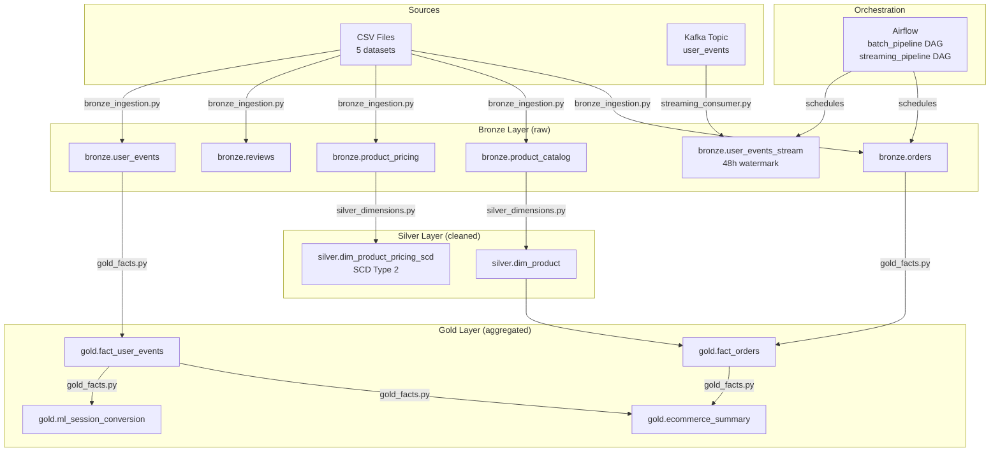

# Architecture

## Overview

The pipeline is split into three independently deployable Docker Compose stacks that all share a single Docker bridge network named **lakehouse**.

```
┌──────────────────────────────────────────────────────────┐
│  processing/docker-compose.yml                           │
│  MinIO · Iceberg REST Catalog · Spark (1 master, 2 wkr)  │
└──────────────────────────────────────────────────────────┘
         ▲                     ▲
         │  s3a://             │  REST /v1/
         │                     │
┌────────┴────────┐   ┌────────┴────────┐
│   MinIO         │   │ Iceberg REST    │
│   :9000 / :9001 │   │ Catalog :8181   │
└─────────────────┘   └─────────────────┘

┌──────────────────────────────────────────────────────────┐
│  streaming/docker-compose.yml                            │
│  Zookeeper · Kafka · Python producer                     │
└──────────────────────────────────────────────────────────┘

┌──────────────────────────────────────────────────────────┐
│  orchestration/docker-compose.yml                        │
│  Postgres · Airflow webserver + scheduler                │
└──────────────────────────────────────────────────────────┘
```

## Data Flow



## Services & Ports

| Service | Port | URL |
|---|---|---|
| Spark Master UI | 8080 | http://localhost:8080 |
| Spark Worker 1 UI | 8081 | http://localhost:8081 |
| Spark Worker 2 UI | 8082 | http://localhost:8082 |
| MinIO Console | 9001 | http://localhost:9001 (minioadmin / minioadmin) |
| MinIO S3 API | 9000 | http://localhost:9000 |
| Iceberg REST Catalog | 8181 | http://localhost:8181 |
| Kafka Broker | 9092 | kafka:9092 (internal) |
| Airflow Webserver | 8085 | http://localhost:8085 (admin / admin) |

## Storage Layout (MinIO)

```
s3://warehouse/
├── bronze/
│   ├── orders/
│   ├── product_catalog/
│   ├── product_pricing/
│   ├── reviews/
│   ├── user_events/
│   └── user_events_stream/
├── silver/
│   ├── dim_product/
│   └── dim_product_pricing_scd/
├── gold/
│   ├── fact_orders/
│   ├── fact_user_events/
│   ├── ecommerce_summary/
│   └── ml_session_conversion/
└── checkpoints/
    └── user_events_stream/
```

## Network

All containers join the `lakehouse` Docker bridge network.  The processing stack creates it; streaming and orchestration stacks reference it as `external: true`.  This means the processing stack must be started first.
