# Data Model

## Layer Overview

| Layer | Purpose | Tables |
|---|---|---|
| **Bronze** | Raw data, as-is from source | orders, product_catalog, product_pricing, reviews, user_events, user_events_stream |
| **Silver** | Cleaned, typed, validated dimensions | dim_product, dim_product_pricing_scd |
| **Gold** | Aggregated, analytics-ready facts | fact_orders, fact_user_events, ecommerce_summary, ml_session_conversion |

---

## Bronze Layer

### bronze.orders

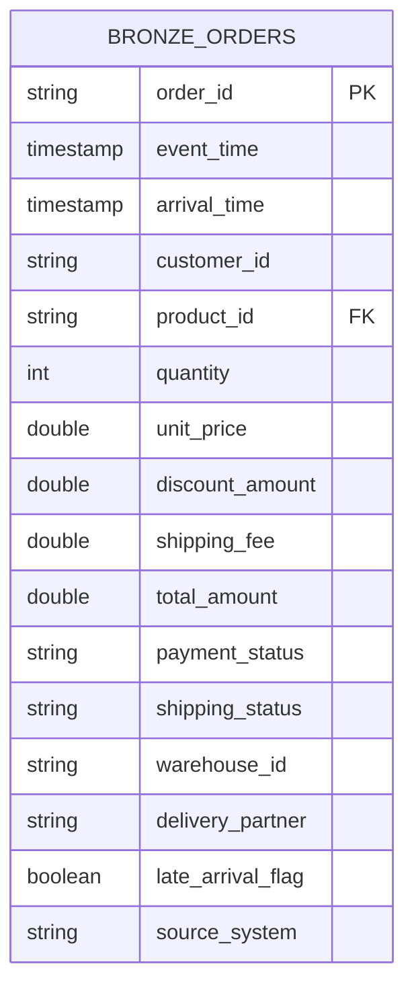

### bronze.product_catalog

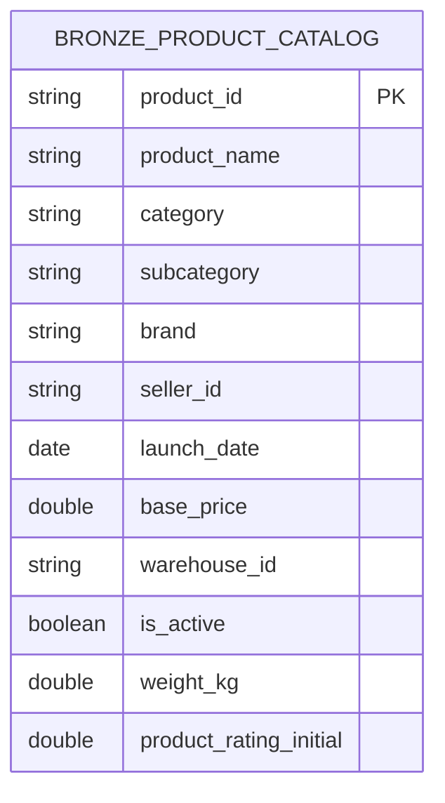

### bronze.product_pricing  *(SCD Type 2 source)*

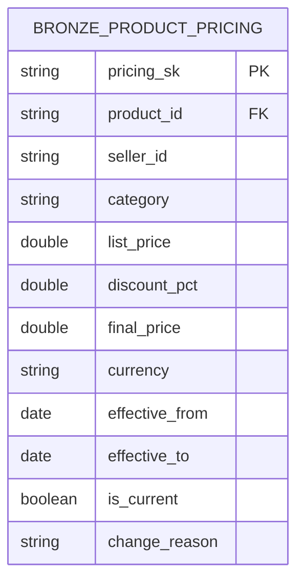

### bronze.reviews

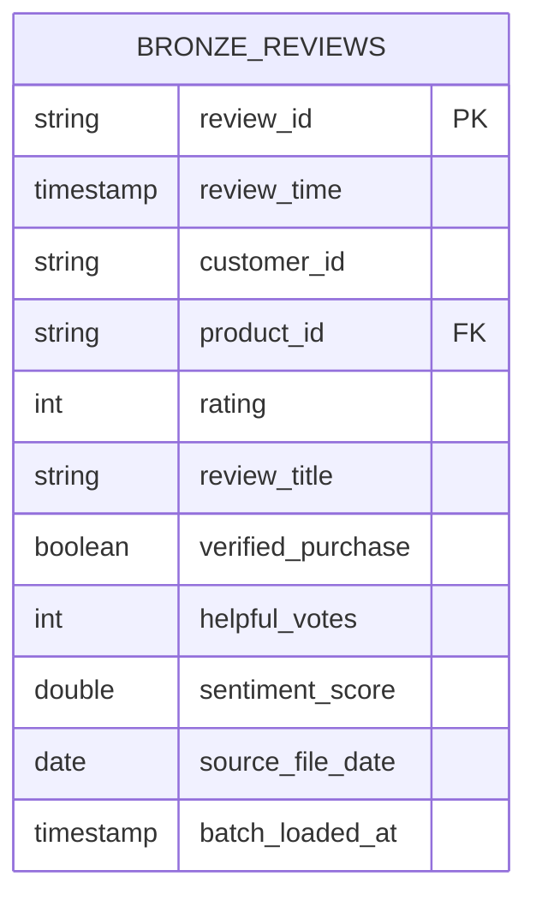

### bronze.user_events  *(batch snapshot)*

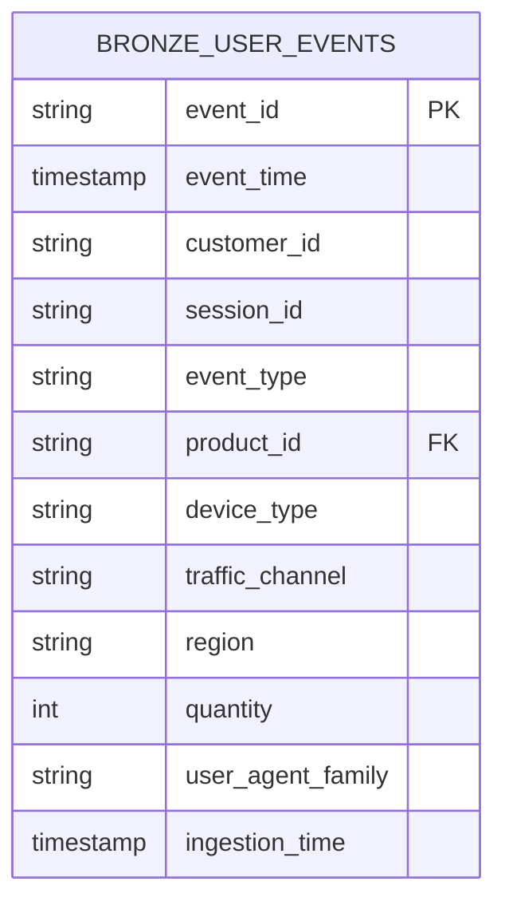

### bronze.user_events_stream  *(Kafka → Iceberg, append)*

Same schema as `user_events` plus:

| Column | Type | Description |
|---|---|---|
| `ingestion_lag_minutes` | DOUBLE | Minutes between event_time and ingestion_time |
| `is_late_arrival` | BOOLEAN | True if ingestion lag > 60 min |
| `stream_loaded_at` | TIMESTAMP | Wall-clock time the micro-batch wrote this row |

**Late-arrival watermark**: 48 hours on `event_time`.

---

## Silver Layer

### silver.dim_product

Cleaned product catalog.  Adds `days_on_market` and `price_tier` derived columns.  Rows with null `product_id` or `product_name` are dropped.

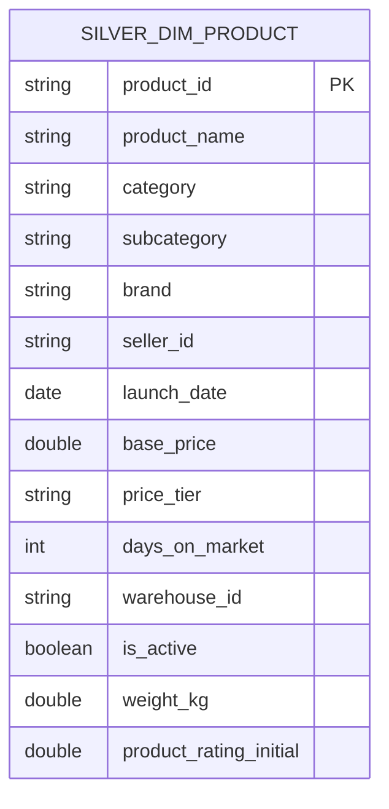

`price_tier` values: `budget` (< $25) · `mid` (< $100) · `premium` (< $300) · `luxury` (≥ $300)

### silver.dim_product_pricing_scd  *(SCD Type 2)*

One row per price change.  `is_current = true` marks the active price.  `effective_to = null` for the current row.

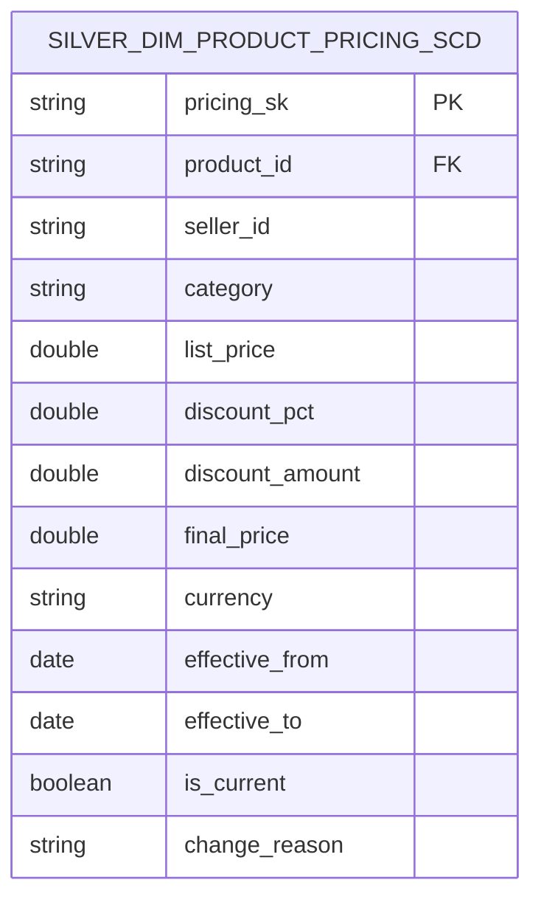

---

## Gold Layer

### gold.fact_orders

One row per order.  Enriched with product category, brand, and computed `arrival_lag_hours`.

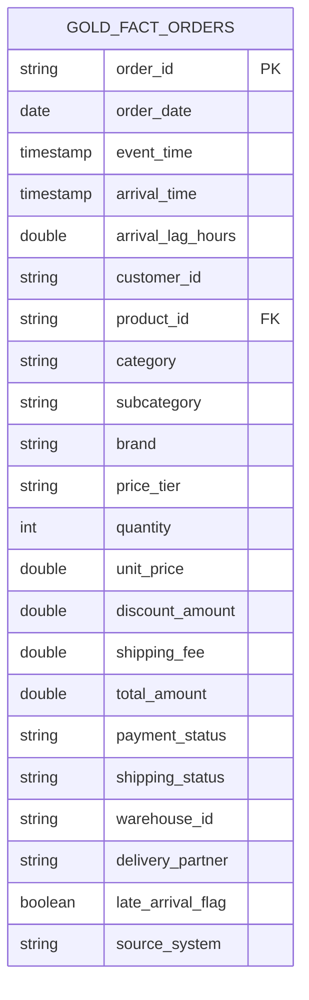

### gold.fact_user_events

One row per user event.  Adds `event_date` and `ingestion_lag_minutes`.

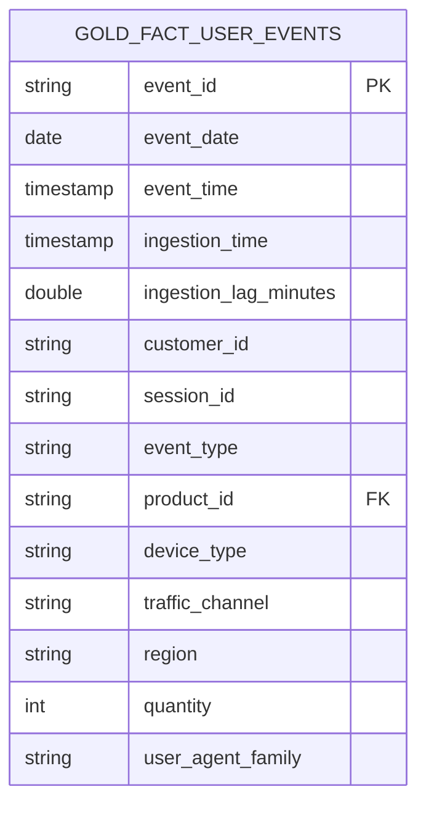

### gold.ecommerce_summary

Daily aggregated summary combining sales, events, and reviews.  Each row has a `row_type` implied by which metric columns are non-null: `sales`, `events`, or `reviews`.

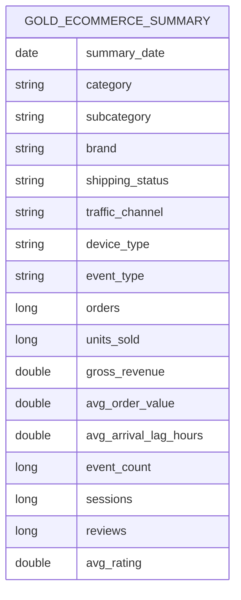

### gold.ml_session_conversion

One row per session.  Features for a binary classification model (converted = purchased).

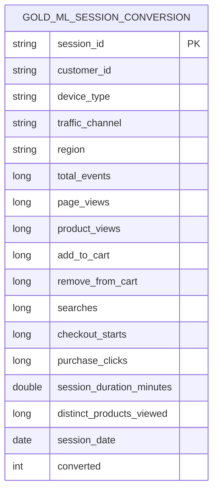

---

## Key Design Decisions

| Decision | Rationale |
|---|---|
| SCD Type 2 for product pricing | Preserves historical price at time of order for accurate revenue analysis |
| Watermark of 48 h on event stream | Handles out-of-order Kafka messages without unbounded state growth |
| Bronze keeps raw types | Schema evolution is handled in Silver/Gold, not at ingestion |
| `arrival_lag_hours` in fact_orders | Enables late-delivery SLA monitoring at query time |
| `ml_session_conversion` in gold | Pre-aggregated session features avoid repeated expensive joins in ML notebooks |
