# Data Model

## Layer Overview

| Layer | Purpose | Tables |
|---|---|---|
| **Bronze** | Raw data, as-is from source | orders, product_catalog, product_pricing, reviews, user_events, user_events_stream, orders_quarantine |
| **Silver** | Cleaned, typed, validated dimensions | dim_product, dim_product_pricing_scd (real SCD Type 2), user_events_stream_clean |
| **Gold** | Aggregated, analytics-ready facts | fact_orders (incremental merge), fact_user_events, ecommerce_summary, ml_session_conversion, realtime_event_summary |

---

## Bronze Layer

### bronze.orders

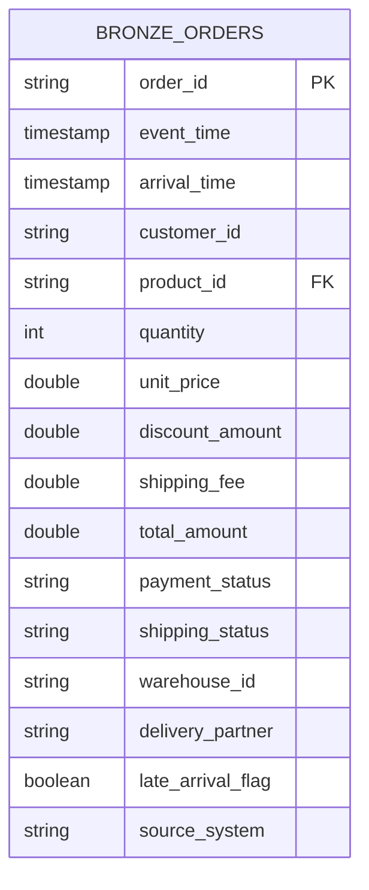
```mermaid
erDiagram
    BRONZE_ORDERS {
        string order_id PK
        timestamp event_time
        timestamp arrival_time
        string customer_id
        string product_id FK
        int quantity
        double unit_price
        double discount_amount
        double shipping_fee
        double total_amount
        string payment_status
        string shipping_status
        string warehouse_id
        string delivery_partner
        boolean late_arrival_flag
        string source_system
    }
```

### bronze.product_catalog

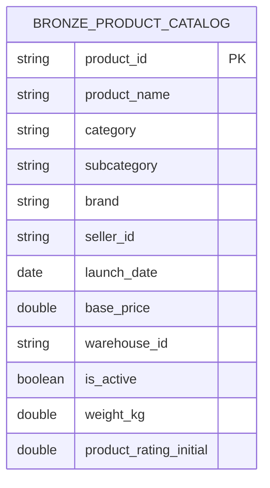
```mermaid
erDiagram
    BRONZE_PRODUCT_CATALOG {
        string product_id PK
        string product_name
        string category
        string subcategory
        string brand
        string seller_id
        date launch_date
        double base_price
        string warehouse_id
        boolean is_active
        double weight_kg
        double product_rating_initial
    }
```

### bronze.product_pricing  *(SCD Type 2 source)*

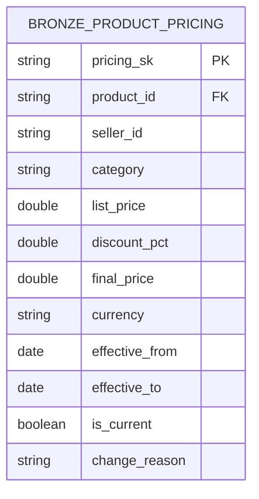
```mermaid
erDiagram
    BRONZE_PRODUCT_PRICING {
        string pricing_sk PK
        string product_id FK
        string seller_id
        string category
        double list_price
        double discount_pct
        double final_price
        string currency
        date effective_from
        date effective_to
        boolean is_current
        string change_reason
    }
```

### bronze.reviews

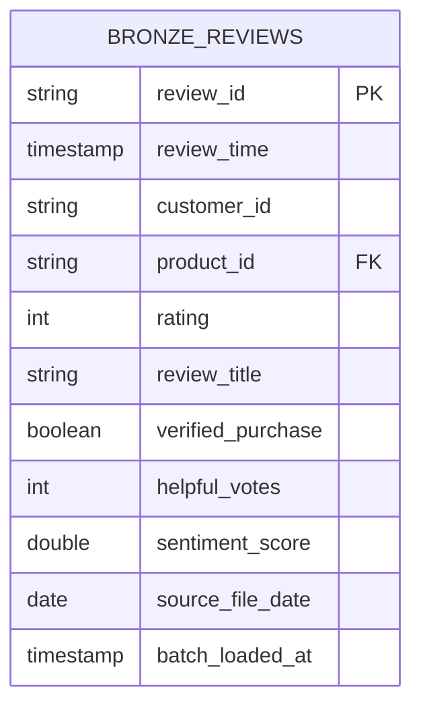
```mermaid
erDiagram
    BRONZE_REVIEWS {
        string review_id PK
        timestamp review_time
        string customer_id
        string product_id FK
        int rating
        string review_title
        boolean verified_purchase
        int helpful_votes
        double sentiment_score
        date source_file_date
        timestamp batch_loaded_at
    }
```

### bronze.user_events  *(batch snapshot)*

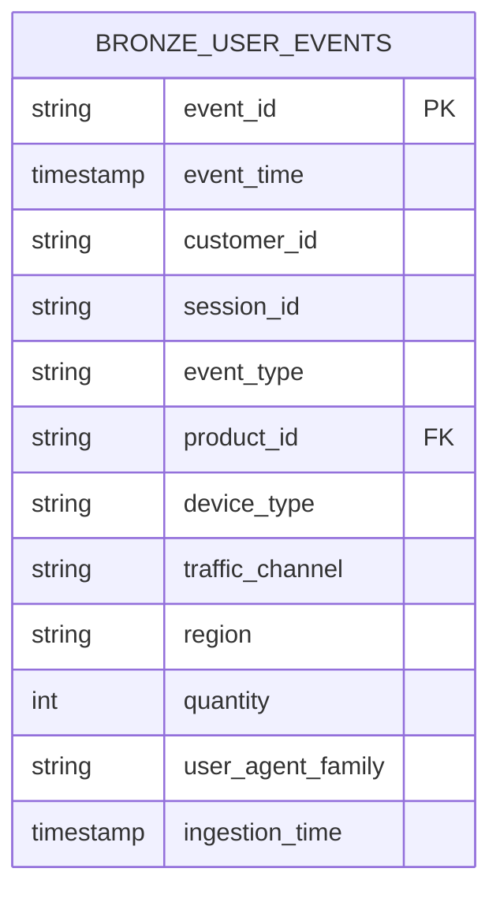
```mermaid
erDiagram
    BRONZE_USER_EVENTS {
        string event_id PK
        timestamp event_time
        string customer_id
        string session_id
        string event_type
        string product_id FK
        string device_type
        string traffic_channel
        string region
        int quantity
        string user_agent_family
        timestamp ingestion_time
    }
```

### bronze.user_events_stream  *(Kafka → Iceberg, append)*

Same schema as `user_events` plus:

| Column | Type | Description |
|---|---|---|
| `ingestion_lag_minutes` | DOUBLE | Minutes between event_time and ingestion_time |
| `is_late_arrival` | BOOLEAN | True if ingestion lag > 60 min |
| `stream_loaded_at` | TIMESTAMP | Wall-clock time the micro-batch wrote this row |

**Late-arrival watermark**: 48 hours on `event_time`.

### bronze.orders_quarantine  *(late orders, append-only)*

Same schema as `bronze.orders` plus `arrival_lag_hours` (DOUBLE) and
`quarantined_at` (TIMESTAMP). Populated by `gold_facts.py::build_orders_quarantine`
for every order whose `arrival_lag_hours > 48`. These orders are **not**
loaded into `demo.gold.fact_orders`. Append-only with an anti-join guard on
`order_id` so re-running the batch pipeline on the same static source does
not re-insert the same quarantined order.

---

## Silver Layer

### silver.dim_product

Cleaned product catalog.  Adds `days_on_market` and `price_tier` derived columns.  Rows with null `product_id` or `product_name` are dropped.

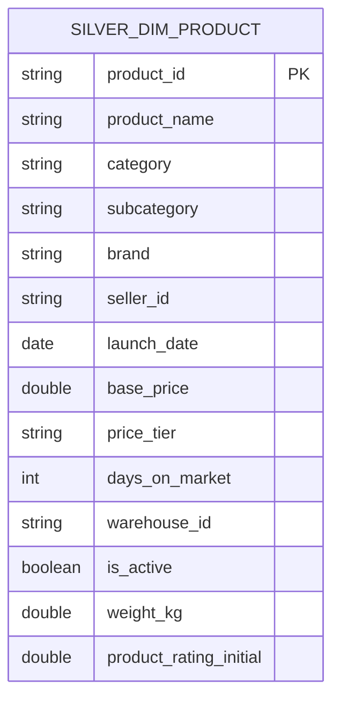
```mermaid
erDiagram
    SILVER_DIM_PRODUCT {
        string product_id PK
        string product_name
        string category
        string subcategory
        string brand
        string seller_id
        date launch_date
        double base_price
        string price_tier
        int days_on_market
        string warehouse_id
        boolean is_active
        double weight_kg
        double product_rating_initial
    }
```

`price_tier` values: `budget` (< $25) · `mid` (< $100) · `premium` (< $300) · `luxury` (≥ $300)

### silver.dim_product_pricing_scd  *(real SCD Type 2)*

One row per price version.  `is_current = true` marks the active price.  `effective_to = null` for the current row.

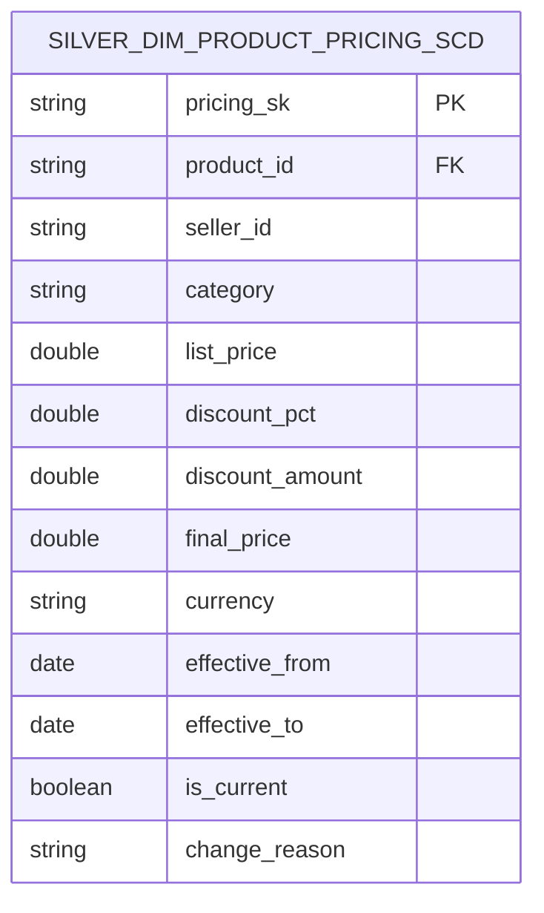
```mermaid
erDiagram
    SILVER_DIM_PRODUCT_PRICING_SCD {
        string pricing_sk PK
        string product_id FK
        string seller_id
        string category
        double list_price
        double discount_pct
        double discount_amount
        double final_price
        string currency
        date effective_from
        date effective_to
        boolean is_current
        string change_reason
    }
```

Built by `silver_dimensions.py`:
- **Bootstrap** (table doesn't exist yet): loads the full historical version
  set already present in the source CSV.
- **Every later run**: `apply_scd_merge()` compares bronze's `is_current=true`
  row per product (today's observed price) against the active Silver row on
  `list_price`/`discount_pct`/`final_price`/`currency`. A detected change
  closes the old row via `MERGE INTO ... WHEN MATCHED THEN UPDATE SET
  is_current=false, effective_to=current_date()`, then appends a new
  current-version row. Unchanged products are left untouched — re-running
  with the same input creates zero new versions.
- Proof script: [`processing/jobs/demo_scd_change.py`](../processing/jobs/demo_scd_change.py).

### silver.user_events_stream_clean  *(deduplicated streaming snapshot)*

Same columns as `bronze.user_events_stream`. Built by
`gold_streaming_summary.py` — full recompute (`createOrReplace`, consistent
with `dim_product`'s pattern) of the Bronze stream table with `event_id`
nulls dropped and `dropDuplicates(["event_id"])` applied as a second
safety net on top of the streaming query's own watermark+dedup.

---

## Gold Layer

### gold.fact_orders  *(incremental MERGE, late orders excluded)*

One row per order.  Enriched with product category, brand, and computed
`arrival_lag_hours`. Only orders with `arrival_lag_hours <= 48` (or no
computable lag) are included — orders arriving later are routed to
`demo.bronze.orders_quarantine` instead (see that table's definition
above). Built by `gold_facts.py::build_fact_orders`: bootstrapped once,
then upserted via `MERGE INTO ... ON t.order_id = s.order_id`, updating a
matched row only when `total_amount`/`payment_status`/`shipping_status`/
`quantity` differ, inserting unmatched rows. Re-running with the same
static source performs zero duplicate inserts.

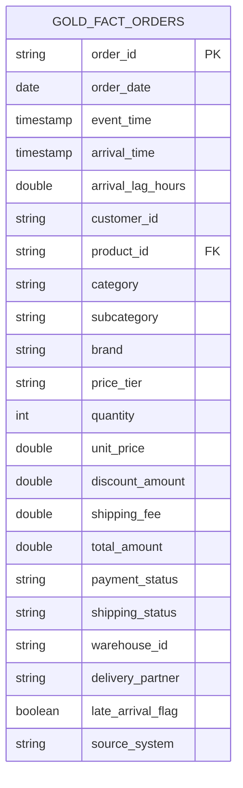
```mermaid
erDiagram
    GOLD_FACT_ORDERS {
        string order_id PK
        date order_date
        timestamp event_time
        timestamp arrival_time
        double arrival_lag_hours
        string customer_id
        string product_id FK
        string category
        string subcategory
        string brand
        string price_tier
        int quantity
        double unit_price
        double discount_amount
        double shipping_fee
        double total_amount
        string payment_status
        string shipping_status
        string warehouse_id
        string delivery_partner
        boolean late_arrival_flag
        string source_system
    }
```

### gold.fact_user_events

One row per user event.  Adds `event_date` and `ingestion_lag_minutes`.

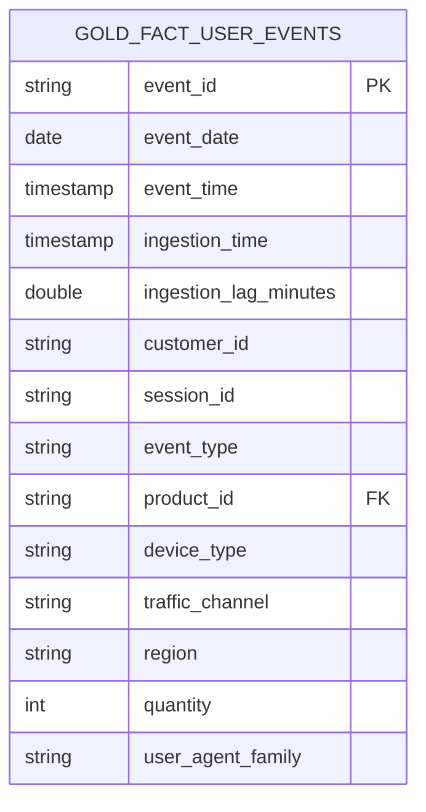
```mermaid
erDiagram
    GOLD_FACT_USER_EVENTS {
        string event_id PK
        date event_date
        timestamp event_time
        timestamp ingestion_time
        double ingestion_lag_minutes
        string customer_id
        string session_id
        string event_type
        string product_id FK
        string device_type
        string traffic_channel
        string region
        int quantity
        string user_agent_family
    }
```

### gold.ecommerce_summary

Daily aggregated summary combining sales, events, and reviews.  Each row has a `row_type` implied by which metric columns are non-null: `sales`, `events`, or `reviews`.

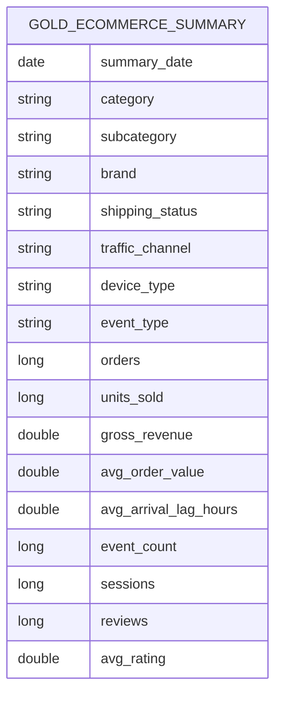
```mermaid
erDiagram
    GOLD_ECOMMERCE_SUMMARY {
        date summary_date
        string category
        string subcategory
        string brand
        string shipping_status
        string traffic_channel
        string device_type
        string event_type
        long orders
        long units_sold
        double gross_revenue
        double avg_order_value
        double avg_arrival_lag_hours
        long event_count
        long sessions
        long reviews
        double avg_rating
    }
```

### gold.ml_session_conversion

One row per session.  Features for a binary classification model (converted = purchased).

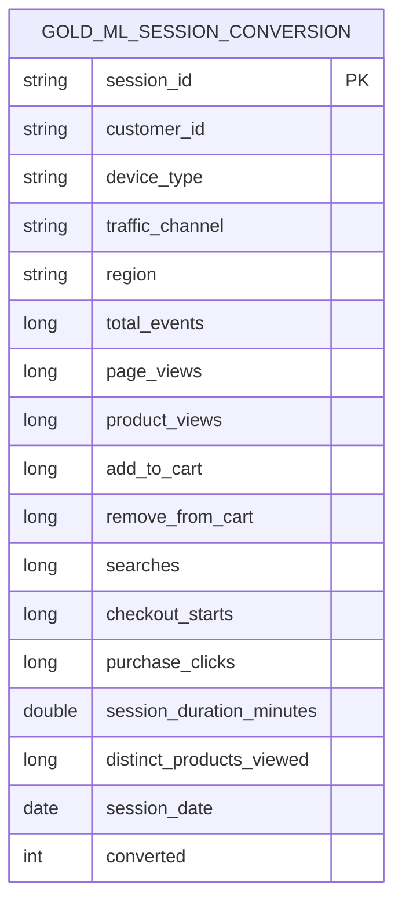
```mermaid
erDiagram
    GOLD_ML_SESSION_CONVERSION {
        string session_id PK
        string customer_id
        string device_type
        string traffic_channel
        string region
        long total_events
        long page_views
        long product_views
        long add_to_cart
        long remove_from_cart
        long searches
        long checkout_starts
        long purchase_clicks
        double session_duration_minutes
        long distinct_products_viewed
        date session_date
        int converted
    }
```

### gold.realtime_event_summary  *(streaming only)*

Daily/hourly aggregate of `silver.user_events_stream_clean`, grouped by
`event_date`, `event_type`, `traffic_channel`, `device_type`.

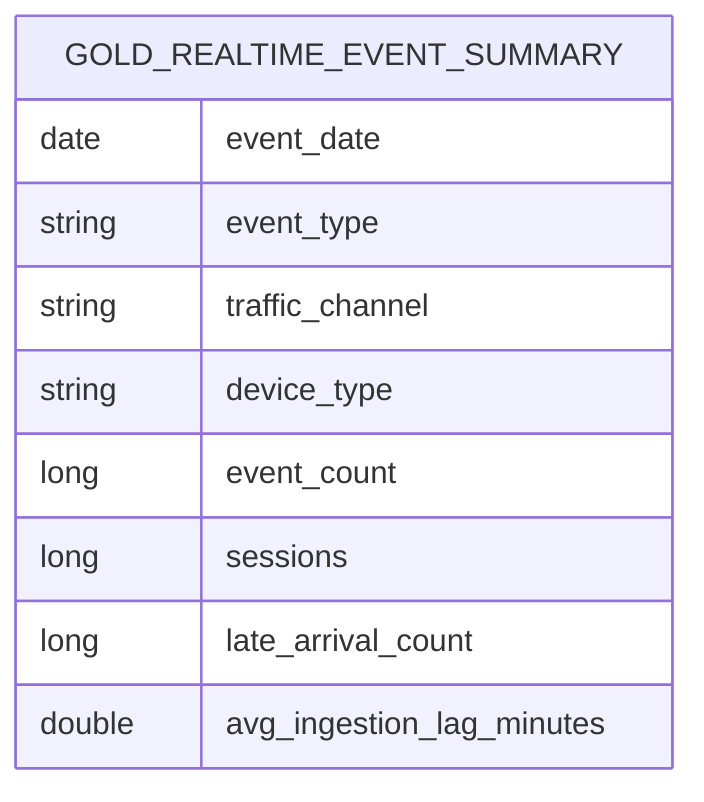
```mermaid
erDiagram
    GOLD_REALTIME_EVENT_SUMMARY {
        date event_date
        string event_type
        string traffic_channel
        string device_type
        long event_count
        long sessions
        long late_arrival_count
        double avg_ingestion_lag_minutes
    }
```

Built by `gold_streaming_summary.py`, surfaced on the dashboard's
"Real-Time Stream Activity" section — this is what proves the Kafka
streaming path actually reaches the business layer instead of dead-ending
at Bronze. Kept separate from `fact_user_events`/`ecommerce_summary`
because the Kafka producer replays the same source CSV that
`bronze_ingestion.py` already batch-loads; merging the two would
double-count every event.

---

## Key Design Decisions

| Decision | Rationale |
|---|---|
| SCD Type 2 for product pricing (real change-detection) | Preserves historical price at time of order for accurate revenue analysis; only inserts a new version when the tracked pricing attributes actually change |
| Watermark of 48 h on event stream | Handles out-of-order Kafka messages without unbounded state growth |
| Bronze keeps raw types | Schema evolution is handled in Silver/Gold, not at ingestion |
| `arrival_lag_hours` in fact_orders + 48h quarantine | Enables late-delivery SLA monitoring and keeps orders that arrived too late out of the business-facing fact table |
| `fact_orders` / `dim_product_pricing_scd` incremental MERGE | Avoids full-table rebuilds and duplicate rows across repeated runs |
| `realtime_event_summary` kept separate from batch event tables | Prevents double-counting since the Kafka producer replays the same source CSV already loaded in batch |
| `ml_session_conversion` in gold | Pre-aggregated session features avoid repeated expensive joins in ML notebooks |
