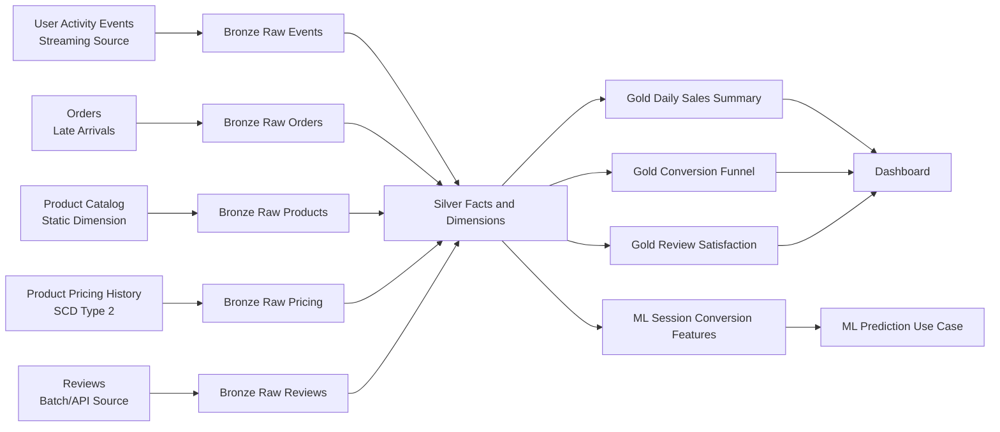

# Mid-Semester Architecture

## Layers

Bronze:

- Raw source-shaped records.

Silver:

- Typed facts and dimensions.
- Late-arrival and ingestion-lag calculations.
- Type 2 SCD pricing dimension.

Gold:

- Business-ready dashboard summaries.
- ML-ready session conversion features.
