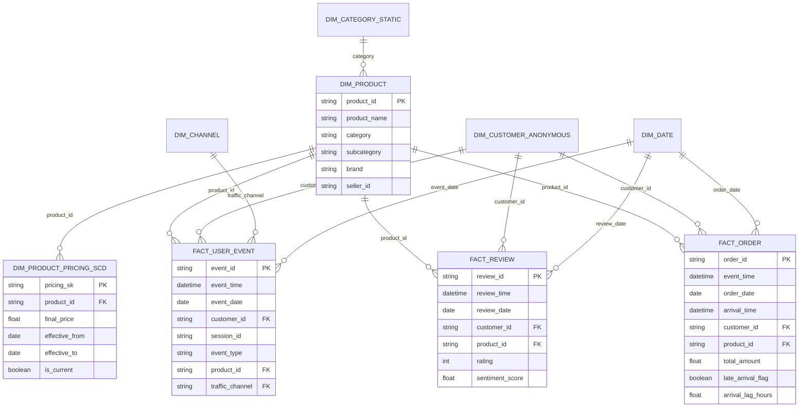

# Mid-Semester Data Model

```mermaid
erDiagram
    DIM_PRODUCT ||--o{ FACT_ORDER : product_id
    DIM_PRODUCT ||--o{ FACT_REVIEW : product_id
    DIM_PRODUCT ||--o{ FACT_USER_EVENT : product_id
    DIM_PRODUCT ||--o{ DIM_PRODUCT_PRICING_SCD : product_id
    DIM_CATEGORY_STATIC ||--o{ DIM_PRODUCT : category
    DIM_CUSTOMER_ANONYMOUS ||--o{ FACT_ORDER : customer_id
    DIM_CUSTOMER_ANONYMOUS ||--o{ FACT_REVIEW : customer_id
    DIM_CUSTOMER_ANONYMOUS ||--o{ FACT_USER_EVENT : customer_id
    DIM_CHANNEL ||--o{ FACT_USER_EVENT : traffic_channel
    DIM_DATE ||--o{ FACT_ORDER : order_date
    DIM_DATE ||--o{ FACT_REVIEW : review_date
    DIM_DATE ||--o{ FACT_USER_EVENT : event_date

    FACT_USER_EVENT {
        string event_id PK
        datetime event_time
        date event_date
        string customer_id FK
        string session_id
        string event_type
        string product_id FK
        string traffic_channel FK
    }

    FACT_ORDER {
        string order_id PK
        datetime event_time
        date order_date
        datetime arrival_time
        string customer_id FK
        string product_id FK
        float total_amount
        boolean late_arrival_flag
        float arrival_lag_hours
    }

    FACT_REVIEW {
        string review_id PK
        datetime review_time
        date review_date
        string customer_id FK
        string product_id FK
        int rating
        float sentiment_score
    }

    DIM_PRODUCT {
        string product_id PK
        string product_name
        string category
        string subcategory
        string brand
        string seller_id
    }

    DIM_PRODUCT_PRICING_SCD {
        string pricing_sk PK
        string product_id FK
        float final_price
        date effective_from
        date effective_to
        boolean is_current
    }
```

## Dashboard Tables

- `gold_daily_sales_summary`
- `gold_conversion_funnel`
- `gold_review_satisfaction_summary`

## ML Table

- `ml_session_conversion_features`
